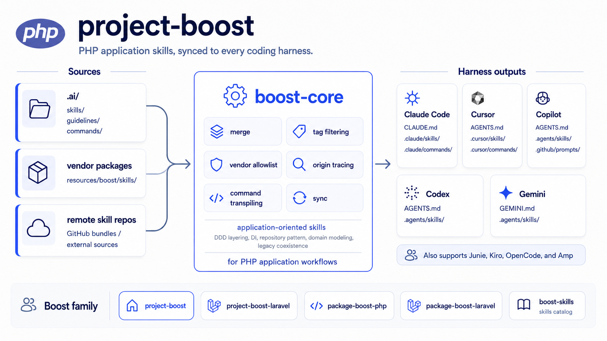

# project-boost-php

[](https://packagist.org/packages/sandermuller/project-boost-php)
[](https://github.com/sandermuller/project-boost-php/actions/workflows/run-tests.yml)
[](https://packagist.org/packages/sandermuller/project-boost-php)
[](LICENSE)
[](https://github.com/laravel/boost)

AI agent skills for PHP application developers — **any framework, or none**. Two framework-agnostic skills (dependency injection, legacy coexistence) plus a `foundation` guideline that frames the codebase as an application, not a package. Rides the [`sandermuller/boost-core`](https://github.com/sandermuller/boost-core) sync engine; ships no code of its own.



> For PHP application developers on any framework or none. [`laravel/boost`](https://github.com/laravel/boost) is Laravel-only; `project-boost-php` covers Symfony, plain-PHP, and framework-agnostic apps. Building a Laravel app? Install [`sandermuller/project-boost-laravel`](https://github.com/sandermuller/project-boost-laravel) instead — it layers `laravel/boost` MCP coexistence on the same nine-agent fanout.

## Which package fits your role?

| You're building                          | Install                                                                                       | Ships                                                                                                |
|------------------------------------------|-----------------------------------------------------------------------------------------------|------------------------------------------------------------------------------------------------------|
| **A PHP application (not a package)**    | **[`sandermuller/project-boost-php`](https://github.com/sandermuller/project-boost-php)**             | **App-dev skills: dependency injection, legacy coexistence + the `foundation` guideline  ← you are here** |
| A Laravel application                    | [`sandermuller/project-boost-laravel`](https://github.com/sandermuller/project-boost-laravel) | `laravel/boost` MCP coexistence + nine-agent fanout + tag filter + remote skills                     |
| A framework-agnostic Composer package    | [`sandermuller/package-boost-php`](https://github.com/sandermuller/package-boost-php)         | Package-author skills + `lean` / `gitattributes` commands                                            |
| A Laravel package                        | [`sandermuller/package-boost-laravel`](https://github.com/sandermuller/package-boost-laravel) | Laravel-package skills + `McpJsonEmitter`                                                            |
| Your own skill bundle, or custom tooling | [`sandermuller/boost-core`](https://github.com/sandermuller/boost-core)                       | The sync engine. You supply the skills.                                                              |

## What you get

**Two skills** — universally-applicable PHP practices, not tied to any architecture.

| Skill                  | Triggers when                                                                              |
|------------------------|--------------------------------------------------------------------------------------------|
| `dependency-injection` | Constructor injection, container hygiene, avoiding service locators.                       |
| `legacy-coexistence`   | Adding modern PHP (typed properties, readonly, enums) to a 7.x codebase incrementally.     |

**One guideline** — `foundation`. Framework-agnostic application-developer framing: what an app codebase is, how its edges form its real contract, and how to work in it. Always shipped, no tag required.

> Want architecture-specific guidance (DDD layering, repositories, domain modeling)? Those shipped through 0.x but were dropped at 1.0 to keep the default framework-agnostic — copy any you want into your own `.ai/skills/<name>/SKILL.md` (host copies shadow vendor skills), or exclude a shipped skill via `->withExcludedSkills(['sandermuller/project-boost-php:<name>'])`.

## How it compares to `laravel/boost`

|                                          | `laravel/boost`                                  | `project-boost-php`                                                              |
|------------------------------------------|--------------------------------------------------|------------------------------------------------------------------------------|
| Framework scope                          | Laravel only                                     | **any PHP** — Symfony, plain-PHP, framework-agnostic                         |
| Skill set                                | Laravel runtime guidelines (Eloquent, Blade, …)  | framework-agnostic app practices (DI, legacy coexistence) + foundation       |
| Agent reach                              | Laravel apps only (broad agent set)              | **non-Laravel apps too** — same agent set via `boost-core`                   |
| Tag filter / remote skills / allowlist   | —                                                | via `boost-core` (`withTags()`, `withRemoteSkills()`, `withAllowedVendors()`)|
| MCP server + Laravel docs API            | ✅                                                | Not in scope; use `laravel/boost` directly in Laravel apps                   |

Both can sit in the same Laravel app via [`project-boost-laravel`](https://github.com/sandermuller/project-boost-laravel) — the family member designed for that combo.

## Install

```bash
composer require --dev sandermuller/project-boost-php
```

PHP 8.3+. Pulls in [`sandermuller/boost-core`](https://github.com/sandermuller/boost-core) transitively.

## First run

```bash
vendor/bin/boost install   # interactive picker — agents + vendor allowlist; writes boost.php
vendor/bin/boost sync      # fan out skills + guideline to selected agents
```

The five skills land in your selected agent skill directories (`.claude/skills/`, `.cursor/skills/`, …); `foundation` merges into each agent's guidelines file (`CLAUDE.md`, `AGENTS.md`, …). Generated dirs are added to `.gitignore` automatically. Edit `.ai/` only — the fan-out regenerates on every sync.

## `boost.php`

Minimal:

```php
<?php declare(strict_types=1);

use SanderMuller\BoostCore\Config\BoostConfig;
use SanderMuller\BoostCore\Enums\Agent;

return BoostConfig::configure()
    ->withAgents([Agent::CLAUDE_CODE, Agent::CURSOR, Agent::CODEX])
    ->withAllowedVendors(['sandermuller/project-boost-php']);
```

`withAllowedVendors()` is explicit — a dependency's skills sync only if its package name is listed. Full `BoostConfig` surface is documented in [`boost-core`'s README](https://github.com/sandermuller/boost-core#readme).

## Where do the skills come from?

`project-boost-php`'s two are one source. Skill sources stack:

1. **Hand-authored** in your project's `.ai/skills/` folder. boost-core picks them up automatically; host overrides shadow vendor-shipped versions of the same name.
2. **Composer-installed catalogs** that ship `resources/boost/skills/`. This package is one example. [`sandermuller/boost-skills`](https://github.com/sandermuller/boost-skills) is another — Sander's personal mix, shared as an illustration of the pattern. Anyone can publish their own.
3. **External non-Composer sources** via `withRemoteSkills()`. GitHub-published `.skill` bundles or single-skill repos. No Composer required.

(`laravel/boost`'s bundled Laravel skills are a fourth source in Laravel apps — surface them via [`project-boost-laravel`](https://github.com/sandermuller/project-boost-laravel).)

`withAllowedVendors()` gates Composer-scanned vendors (source 2) only. `withTags()` filters sources 2 and 3. Host skills (source 1) bypass both — your project authored them, so the engine treats them as canonical and applies neither filter.

## Coexistence

- **Laravel application?** Install [`sandermuller/project-boost-laravel`](https://github.com/sandermuller/project-boost-laravel) instead. It coexists with `laravel/boost` (MCP server + Laravel docs API) and layers in the family's filtering controls + nine-agent fanout.
- **Composer package, not an application?** Install [`sandermuller/package-boost-php`](https://github.com/sandermuller/package-boost-php). The five skills here assume an app — the `foundation` framing diverges from package-author rules.
- **Mixed stack?** Allowlist multiple sources in `boost.php`. Host overrides in `.ai/skills/` shadow vendor copies of the same name; collisions across vendors surface as sync errors with a one-line resolution hint.

## Auto-sync on `composer install`

Wire the callback into your own project's `composer.json` so a `composer install` / `composer update` re-syncs:

```json
"scripts": {
    "post-install-cmd": ["SanderMuller\\BoostCore\\Scripts\\BoostAutoSync::run"],
    "post-update-cmd":  ["SanderMuller\\BoostCore\\Scripts\\BoostAutoSync::run"]
}
```

`BOOST_SKIP_AUTOSYNC=1` disables the callback. Full detail in [`boost-core`'s automating-the-sync section](https://github.com/sandermuller/boost-core#automating-the-sync).

## Testing

```bash
composer test
```

Pest suite — sanity tests on the shipped skill + guideline set: skills parse with a `name` matching the filename and a non-empty `description`; guidelines are frontmatter-free and open with a Markdown heading.

## License

MIT. See [LICENSE](LICENSE).
